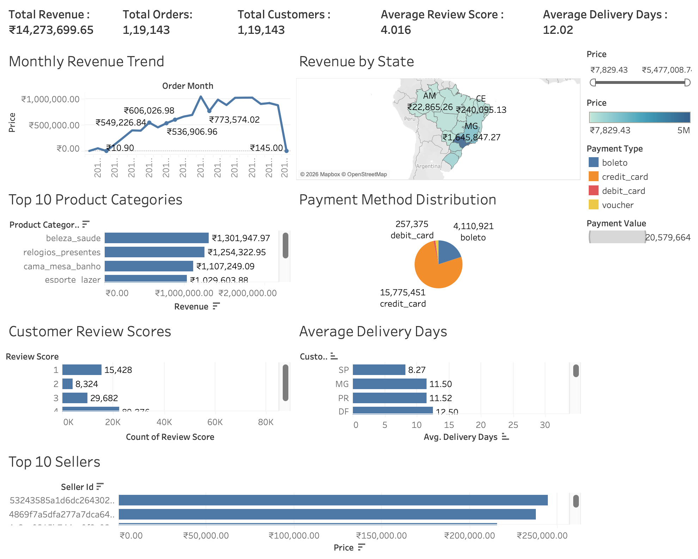

# 📊 E-Commerce Sales Analytics Dashboard

An end-to-end **Data Analytics** project built using **Python, SQL, SQLite, and Tableau** to analyze over **119,000 e-commerce transactions** from the Olist Brazilian E-Commerce Dataset.

The project demonstrates the complete analytics workflow—from raw data cleaning and integration to SQL-based business analysis and an interactive Tableau dashboard for business decision-making.

---

## 📊 Dashboard Preview



---

# 📌 Project Overview

Businesses generate massive amounts of sales and customer data every day. However, raw data alone does not provide actionable insights.

This project transforms raw e-commerce data into meaningful business intelligence by performing:

* Data auditing and quality assessment
* Data cleaning and preprocessing
* Data integration from multiple datasets
* Exploratory Data Analysis (EDA)
* SQL-based business analysis using SQLite
* Interactive Tableau dashboard development

The final dashboard enables stakeholders to monitor revenue trends, customer behavior, payment preferences, delivery performance, and product sales.

---

# 🎯 Business Problem

The objective of this project is to answer key business questions such as:

* Which product categories generate the highest revenue?
* Which states contribute the most sales?
* What are the preferred payment methods?
* How satisfied are customers based on review scores?
* How efficient is product delivery?
* Who are the top-performing sellers?
* What monthly sales trends can be observed?

These insights help support data-driven business decisions.

---

# 📂 Dataset

**Dataset:** Olist Brazilian E-Commerce Dataset

The dataset contains transactional information from a Brazilian e-commerce platform, including:

* Orders
* Customers
* Sellers
* Products
* Payments
* Reviews
* Geolocation information

After data integration, the final master dataset contains **119,000+ transaction records** used for analysis.

---

# 🛠 Technology Stack

| Category             | Technologies        |
| -------------------- | ------------------- |
| Programming          | Python              |
| Data Analysis        | Pandas, NumPy       |
| Visualization        | Matplotlib, Tableau |
| Database             | SQLite              |
| Query Language       | SQL                 |
| Notebook Environment | Jupyter Notebook    |
| Version Control      | Git & GitHub        |

---

# ⚙️ Project Workflow

```
Raw CSV Files
        │
        ▼
Data Audit
        │
        ▼
Data Cleaning
        │
        ▼
Data Integration
        │
        ▼
Exploratory Data Analysis
        │
        ▼
SQLite Database
        │
        ▼
Business SQL Queries
        │
        ▼
Interactive Tableau Dashboard
```

---

# 📁 Project Structure

```
ecommerce-sales-analytics/
│
├── data/
│   ├── raw/
│   └── processed/
│
├── notebooks/
│   ├── 01_data_audit.ipynb
│   ├── 02_data_cleaning.ipynb
│   ├── 03_data_preparation_and_integration.ipynb
│   └── 04_exploratory_data_analysis.ipynb
│
├── sql/
│   ├── ecommerce.db
│   ├── business_queries.sql
│   └── load_data.py
│
├── dashboard/
│   └── ecommerce_dashboard.twbx
│
├── images/
│   └── dashboard.png
│
├── reports/
├── requirements.txt
├── README.md
└── .gitignore
```

---

# 📈 Dashboard Features

The Tableau dashboard includes:

* 💰 Total Revenue KPI
* 📦 Total Orders KPI
* 👥 Total Customers KPI
* ⭐ Average Review Score KPI
* 🚚 Average Delivery Days KPI
* 📈 Monthly Revenue Trend
* 🗺 Revenue by State
* 🛍 Top Product Categories
* 💳 Payment Method Distribution
* ⭐ Customer Review Distribution
* 🚚 Delivery Performance Analysis
* 🏆 Top Sellers Analysis

---

# 💡 Key Business Insights

* Revenue trends reveal seasonal purchasing patterns.
* Credit Card is the most preferred payment method.
* São Paulo contributes the highest overall sales.
* A small number of product categories generate a significant share of revenue.
* Most customers provide 4- and 5-star ratings, indicating high customer satisfaction.
* Delivery performance varies across different states.
* A small group of sellers contributes a large proportion of total revenue.

---

# 🗄 SQL Analysis

The project includes business-focused SQL analysis covering:

* Order Analysis
* Revenue Analysis
* Customer Analysis
* Product Analysis
* Payment Analysis
* Delivery Analysis
* Seller Performance
* Customer Reviews

The SQL implementation demonstrates:

* JOINs
* GROUP BY
* Aggregate Functions
* CASE Statements
* Window Functions
* Ranking Functions
* Common Table Expressions (CTEs)

---

# 🚀 How to Run

1. Clone this repository.

```
git clone https://github.com/Kakshay04/ecommerce-sales-analytics.git
```

2. Install dependencies.

```
pip install -r requirements.txt
```

3. Run the Jupyter notebooks in sequence.

4. Execute the SQL scripts to create the SQLite database.

5. Open the Tableau workbook (`dashboard/ecommerce_dashboard.twbx`) to explore the interactive dashboard.

---

# 🔮 Future Improvements

* Build a Power BI version of the dashboard.
* Add sales forecasting using Machine Learning.
* Automate dashboard refresh with scheduled data updates.
* Deploy the dashboard using Tableau Public.
* Integrate with a live database.

---

# 👨‍💻 Author

**Akshay Kulkarni**

Final Year Electronics Engineering Student
Interested in Data Analytics, Business Intelligence, SQL, Python, and Data Visualization.

If you found this project useful, feel free to ⭐ the repository.
